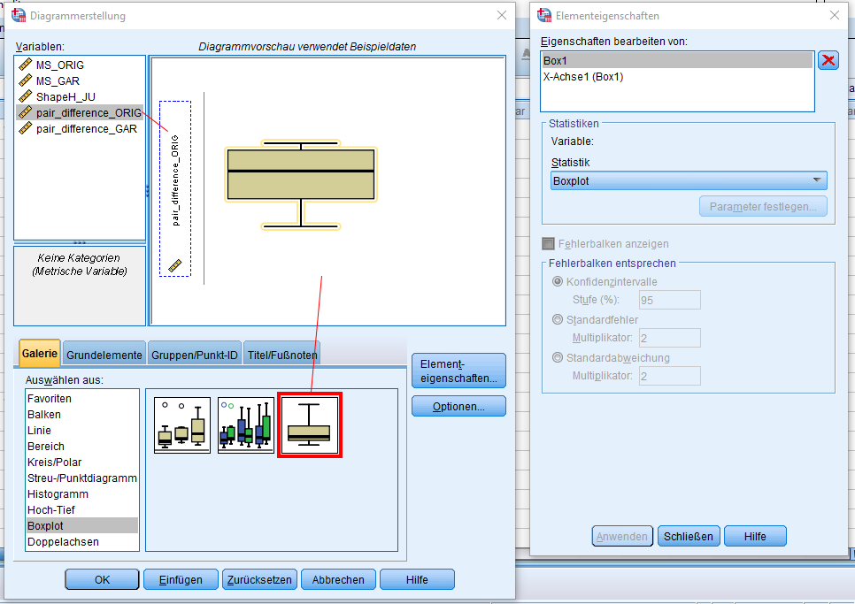
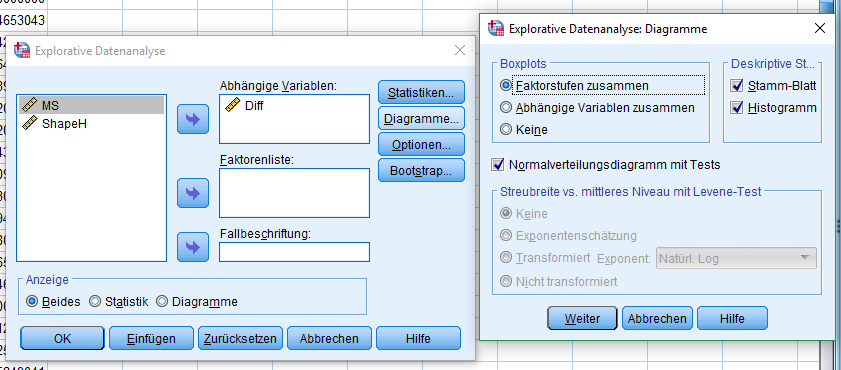
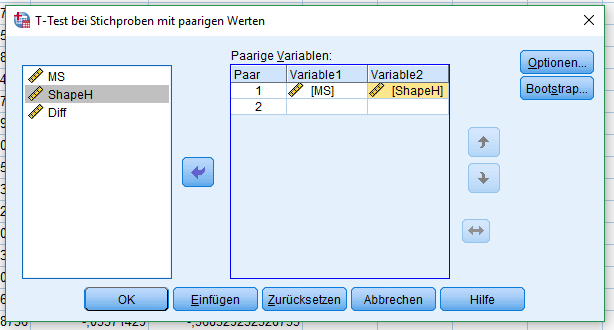
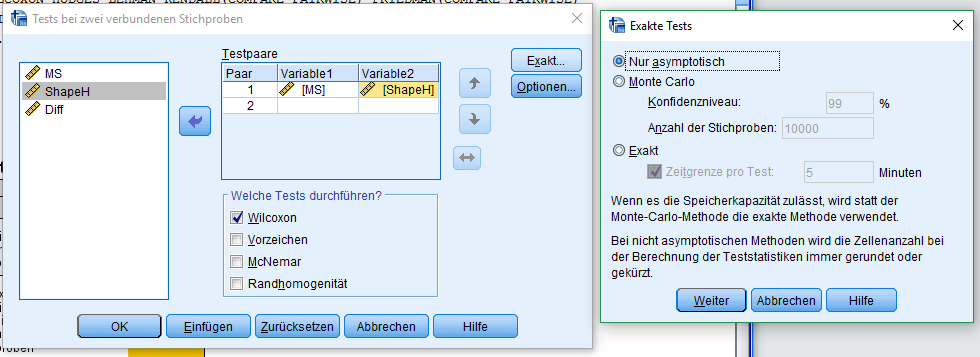

Auswertung mit SPSS
============================================================

Datasets
------------------------------------------------------------

### Ähnlichkeitswerte
`aehnlichkeitswerte.sav`
#### Datenbeschreibung
| Name   | Typ       | Beschreibung                         | Messniveau |
|--------|-----------|--------------------------------------|------------|
| MS     | Numerisch | Ähnlichkeitswert Mongeau&Sankoff-Maß | Metrisch   |
| ShapeH | Numerisch | Ähnlichkeitswert ShapeH              | Metrisch   |
| Diff   | Numerisch | Differenz (B-A)                      | Metrisch   |

#### Boxplot für Paardifferenzen
Boxplots lassen sich im Menü `Grafik` > `Diagrammerstellung` erstellen.
Das Dialogfeld zum Messniveau und den Wertebeschriftungen kann in diesem Fall mit `OK` bestätigt werden.

Im unteren Bereich des nächsten Dialogs wird im Reiter `Galerie` unter `Boxplot`  der `1-D Boxplot` per Drag&Drop
in die Digrammvorschau eingefügt.

Die Daten können aus der linken Spalte `Variablen` in die Diagrammvorschau eingefügt werden.

#### Test auf Normalverteilung
Für die Weiterverarbeitung ist die Prüfung der Paardifferenzen auf Normalverteilung erforderlich.

Im Menü `Analysieren` > `Deskriptive Statistiken` > `Explorative Datenanalyse` wird als abhängige Variable `Diff`
gewählt.
Unter `Diagramme` muss schließlich noch der Haken bei `Normalverteilungsdiagramm mit Tests`. Als Visualisierung kann
hier das `Histogramm` gewählt werden [1].

Spss verwendet hierbei neben Kolmogorov-Smirnov (Signofikanzkorrektur nach Lilliefors) den Shapiro-Wilk-Test.

#### Entscheidungshilfe für statistische Tests
**Übersicht** [2]:

|                                                   | Parametrisch                          | Nichtparametrisch           |
|---------------------------------------------------|---------------------------------------|-----------------------------|
| Daten                                             | normalverteilt                        | nicht normalverteilt        |
| Vergleich von 2 unabhängigen Stichproben          | t-Test                                | Mann-Whitney-U-Test         |
| Vergleich von 2 abhängigen Stichproben            | gepaarter t-Test                      | Wilcoxon Paarvergleichstest |
| Vergleich von mehr als 2 unabhängigen Stichproben | einfaktorielle Varianzanalyse         | Kruskal-Wallis-Test         |
| Vergleich von mehr als 2 abhängigen Stichproben   | Varianzanalyse mit Messwiederholungen | Friedman-Test               |
| Korrelation zwischen 2 Stichproben                | Pearson-Korrelation                   | Spearman-Korrelation        |

#### T-Test für abhängige Stichproben
Im Menü `Analysieren` > `Mittelwerte vergleichen` > `t-Test bei verbundenen Stichproben`. Als Variablen werden `MS` und
`ShapeH` verwendet, welche den einzelnen Messwerten entsprechen.

#### Wilcoxon Paarvergleichstest
Im Menü `Analysieren` > `Nicht parametrische Tests` > `Alte Dialogfelder` > `Zwei verbundene Stichproben`.

---

Quellen:
------------------------------------------------------------
[1] http://novustat.com/statistik-glossar/test-auf-normalverteilung-shapiro-wilk-test-spss.html

[2] http://www.statistik-und-beratung.de/2012/09/parametrisch-oder-nichtparametrisch-das-ist-hier-die-frage/