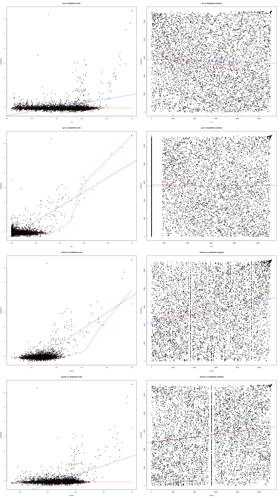

dva - Evaluation
==================================================
This subproject evaluates similarity scores for the subcollection "dva" of the Essen Folksong Collection available from [KernScores](http://kern.humdrum.org/cgi-bin/browse?l=/essen/europa).

The implemented algorithms ms, gar, interval and parson are evaluated against 2015-shapeh and 2015-shapetime algorithm of the [MelodyShape](https://github.com/julian-urbano/MelodyShape)-Implementation by Julian Urbano [[1]](#sources).

For general information, what the repository is about, have a look at [Project root](https://github.com/freakimkaefig/musicjson-evaluation).

Results
--------------------------------------------------

Correlations:

- [Correlation coefficients](correlations.md)

Tutorials
--------------------------------------------------
The following links document evaluation steps for specific programs.

- [R](R.md)

Sources
--------------------------------------------------
[1] Urbano, J. (2015). MelodyShape at MIREX 2015 Symbolic Melodic Similarity.
In 11th Music Information Retrieval Evaluation eXchange (MIREX 2015). Retrieved 
from http://www.music-ir.org/mirex/abstracts/2015/JU1.pdf
