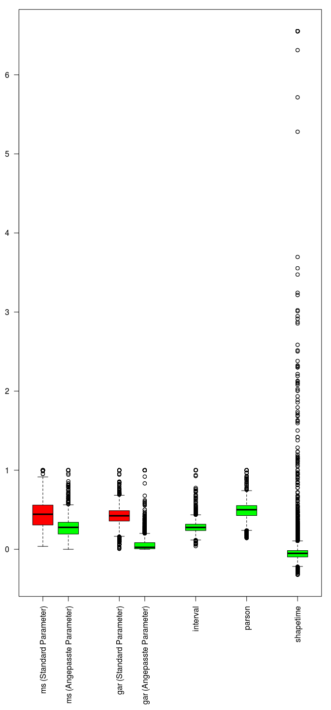
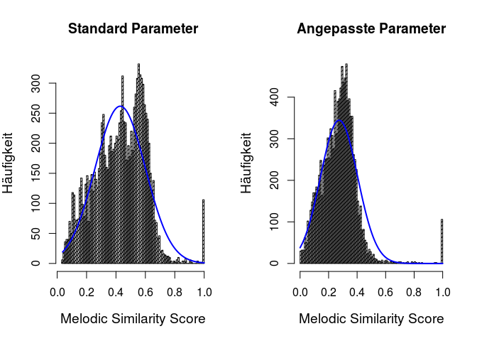
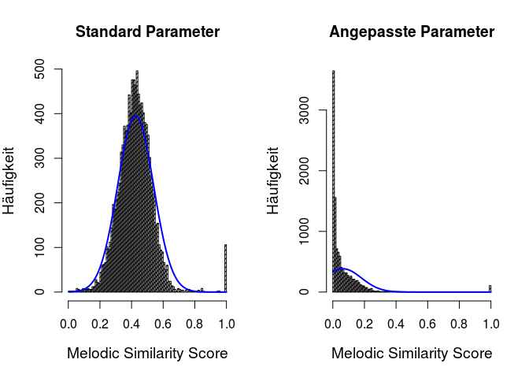
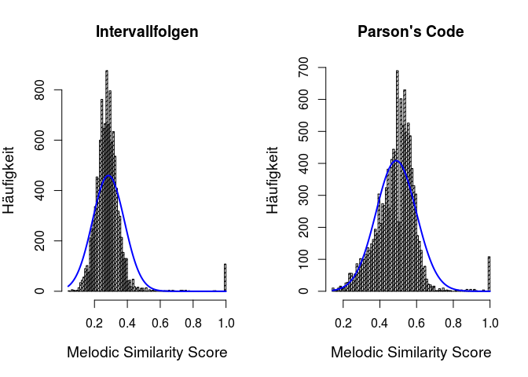
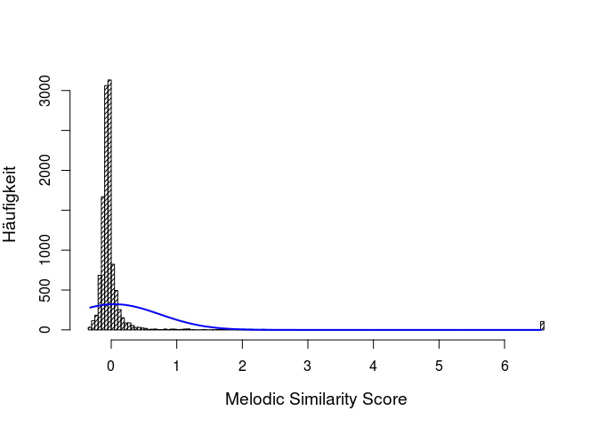
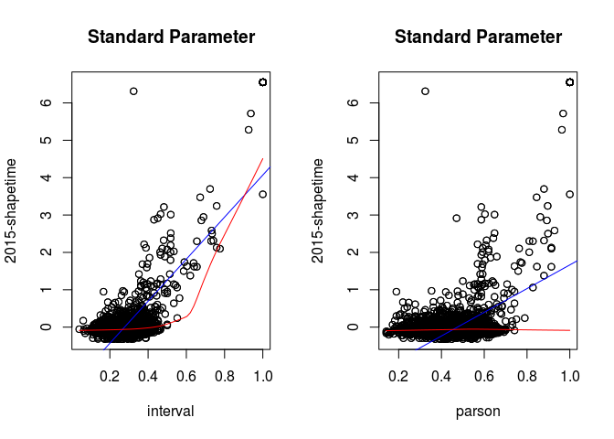

Deskriptive Statistik
---------------------

    ## 
    ## ==============================================================
    ## Statistic  Min   Pctl(25) Median Mean  Pctl(75)  Max  St. Dev.
    ## --------------------------------------------------------------
    ## ms        0.037   0.307   0.443  0.429  0.559   1.000  0.171  
    ## gar       0.005   0.357   0.423  0.426  0.488   1.000  0.113  
    ## interval  0.040   0.237   0.276  0.285  0.317   1.000  0.097  
    ## parson    0.142   0.427   0.500  0.489  0.553   1.000  0.110  
    ## shapetime -0.321  -0.097  -0.051 0.047  -0.016  6.551  0.696  
    ## --------------------------------------------------------------

    ## 
    ## ==============================================================
    ## Statistic  Min   Pctl(25) Median Mean  Pctl(75)  Max  St. Dev.
    ## --------------------------------------------------------------
    ## ms        0.000   0.193   0.277  0.273  0.341   1.000  0.130  
    ## gar       0.000   0.006   0.025  0.064  0.084   1.000  0.117  
    ## interval  0.040   0.237   0.276  0.285  0.317   1.000  0.097  
    ## parson    0.142   0.427   0.500  0.489  0.553   1.000  0.110  
    ## shapetime -0.321  -0.097  -0.051 0.047  -0.016  6.551  0.696  
    ## --------------------------------------------------------------

Histogramme
-----------

### Mongeau & Sankoff (1990) (ms)

### Gómez, Abad-Mota, & Ruckhaus (2007) (gar)

### Intervalfolgen (interval) & Parson's Code Zeichenketten (parson)

### Urbano (2015), ShapeTime (shapetime)

Scatterplots
------------

### Mongeau & Sankoff (1990) (ms)

### Gómez et al. (2007) (gar)

### Intervalfolgen (interval) & Parson's Code Zeichenketten (parson)

Korrelations-Koeffizienten nach Spearman
----------------------------------------

### Mongeau & Sankoff (1990) (ms)

#### Standard Parameter

    ##       x     y
    ## x  1.00 -0.04
    ## y -0.04  1.00
    ## 
    ## n= 11236 
    ## 
    ## 
    ## P
    ##   x  y 
    ## x     0
    ## y  0

#### Angepasste Parameter

    ##       x     y
    ## x  1.00 -0.04
    ## y -0.04  1.00
    ## 
    ## n= 11236 
    ## 
    ## 
    ## P
    ##   x  y 
    ## x     0
    ## y  0

### Gómez et al. (2007) (gar)

#### Standard Parameter

    ##       x     y
    ## x  1.00 -0.02
    ## y -0.02  1.00
    ## 
    ## n= 11236 
    ## 
    ## 
    ## P
    ##   x      y     
    ## x        0.0431
    ## y 0.0431

#### Angepasste Parameter

    ##      x    y
    ## x 1.00 0.01
    ## y 0.01 1.00
    ## 
    ## n= 11236 
    ## 
    ## 
    ## P
    ##   x      y     
    ## x        0.5032
    ## y 0.5032

### Intervalfolgen (interval)

    ##      x    y
    ## x 1.00 0.24
    ## y 0.24 1.00
    ## 
    ## n= 11236 
    ## 
    ## 
    ## P
    ##   x  y 
    ## x     0
    ## y  0

### Parson's Code Zeichenketten (parson)

    ##      x    y
    ## x 1.00 0.14
    ## y 0.14 1.00
    ## 
    ## n= 11236 
    ## 
    ## 
    ## P
    ##   x  y 
    ## x     0
    ## y  0

Literatur
---------

Gómez, C., Abad-Mota, S., & Ruckhaus, E. (2007). An Analysis of the Mongeau-Sankoff Algorithm for Music Information Retrieval. *Proceedings of the 8th International Conference on Music Information Retrieval (ISMIR)*, 109–110.

Mongeau, M., & Sankoff, D. (1990). Comparison of musical sequences. *Computers and the Humanities*, *24*(3), 161–175. <https://doi.org/10.1007/BF00117340>

Urbano, J. (2015). MelodyShape at MIREX 2015 Symbolic Melodic Similarity. In *11th Music Information Retrieval Evaluation eXchange (MIREX 2015)*.
